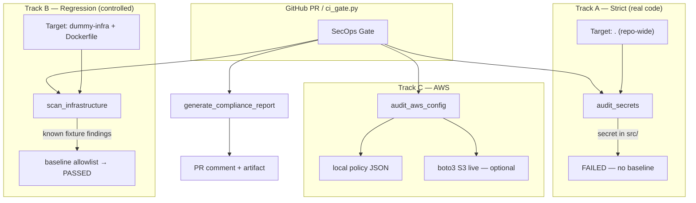
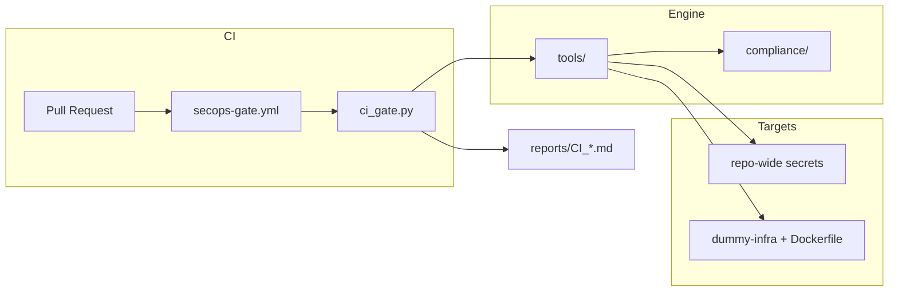

# DevSecOps Compliance Pipeline (with MCP)


> **Deterministic Python DevSecOps pipeline** — Semgrep SAST, Trivy SCA/infra, Checkov, boto3 scan, ISMS-P·전자금융 Lab report, PR merge gate. MCP is the optional agent interface, not the security engine.

[Sample Report](./reports/SAMPLE_AUDIT_REPORT.md) · [Sample Dashboard](./reports/SAMPLE_DASHBOARD.html) · [Repository](https://github.com/jhnnnp/K-SecOps) · [Validation Sources](./docs/VALIDATION_SOURCES.md) · [CI Evidence Guide](./docs/CI_EVIDENCE.md) · [AWS Live Scan](./docs/AWS_LIVE_SCAN.md) · [JD Mapping](./docs/JD_MAPPING.md)

---

## Multi-Track Scope (Core Design)



| Track | Scanner | CI target | Gate behavior |
|-------|---------|-----------|---------------|
| **A** | `audit_secrets` | `.` (entire repo) | `src/` etc. secret → **immediate FAIL** |
| **B** | `scan_infrastructure` | `dummy-infra`, `Dockerfile` | CRITICAL in fixture → baseline only |
| **C** | `audit_aws_config` | `dummy-infra/aws` | policy JSON + optional boto3 live |
| **D** | `audit_sast` (Semgrep / regex) | `.` (src + fixtures) | `src/` SAST finding → **immediate FAIL** |
| **E** | `scan_dependencies` (Trivy SCA) | `requirements.txt`, `dummy-infra/deps` | app manifest HIGH+ CVE (NVD) → **FAIL** |
| **F** | `sbom_gate` + CycloneDX SBOM | `requirements.txt` | unauthorized direct dep → **FAIL** |

- **MCP agent**: strict sandbox — `dummy-infra/`, `reports/` only
- **CI**: `SECOPS_REPO_SCAN=1` — secrets scan real application code

### CI Evidence (portfolio)

<!-- CI_EVIDENCE_AUTO_START -->
_Auto-generated by `scripts/sync_ci_evidence.py`. Do not edit manually._

# CI Evidence (auto-synced)

_Last updated: 2026-06-27 17:24 UTC_


## Demo PR status

| Demo | PR | Check | Expected | Actual |
|------|-----|-------|----------|--------|
| PASSED | [#1](https://github.com/jhnnnp/K-SecOps/pull/1) | `devsecops-gate` | success | **UNKNOWN** |
| FAILED (intentional) | [#2](https://github.com/jhnnnp/K-SecOps/pull/2) | `devsecops-gate` | failure | **PENDING** |

- PASSED run: https://github.com/jhnnnp/K-SecOps/actions/runs/28296390825/job/83836946875
- FAILED run: https://github.com/jhnnnp/K-SecOps/actions/runs/28296391939/job/83836950137

## Gate comment snapshot (FAILED PR)

```text
<!-- devsecops-gate -->
**CI Gate:** FAILURE
# DevSecOps CI Gate: FAILED
## Multi-Track Scope
- Secrets scan (repo-wide): `.`
- SAST scan (`semgrep`): `.`
- SCA / Dependency CVE scan (Trivy vuln DB): `requirements.txt, dummy-infra/deps`
- SBOM drift gate: `requirements.txt` (5 direct deps, baseline 5)
- Infrastructure scan (fixture + self): `dummy-infra, Dockerfile`
## Risk Score
- Composite risk: **100/100** (CRITICAL)
- Blockers: **1**
```

## Validation

- PR #1 should be **green** (baseline dummy-infra only).
- PR #2 should be **red** (`src/main.py` intentional secret). Do not merge.

Regenerate locally:

```bash
export GH_TOKEN=$(gh auth token)   # after gh auth login
python3 scripts/sync_ci_evidence.py
```
<!-- CI_EVIDENCE_AUTO_END -->

Step-by-step: **[docs/CI_EVIDENCE.md](./docs/CI_EVIDENCE.md)**

---

## What This Project Is

1. **Deploy-pre infrastructure & code security scan** — Trivy, Checkov, regex secrets, AWS policy
2. **Compliance translation** — findings → ISMS-P / 전자금융 Lab fields (JSON lookup, no LLM hallucination)
3. **PR merge gate** — GitHub Actions [`secops-gate.yml`](.github/workflows/secops-gate.yml)
4. **Optional MCP layer** — Cursor/Claude can invoke the same tools; core logic is plain Python

**Not:** 24/7 SIEM, commercial WAF/EPP operation, or LLM-driven compliance judgment.

### Secret Architecture (Envelo lineage)

1. **Detect** — CI repo-wide `audit_secrets` blocks plaintext keys in `src/` (1st line of defense).
2. **Prescribe** — Lab report `recommended_action` maps to **OPAQUE + E2EE Zero-Knowledge Vault** (Envelo-style): no env hardcoding, runtime attested fetch only.
3. **Operate** — Go alert-worker notifies SecOps on gate FAIL (2nd line: human visibility beyond PR comments).

---

## Pipeline Steps

1. **Scan** — Trivy + Checkov (CVE, misconfig)
2. **PII masking** — KR_RRN, account numbers in logs
3. **Secret audit** — AWS/API keys (repo-wide in CI)
4. **AWS config audit** — IAM/S3 policy + optional boto3 live
5. **Compliance report** — ISMS-P / EFT Markdown
6. **CI gate** — block merge on new secrets / critical misconfigs
7. **SecOps alert** — Go worker → Slack/Discord webhook on FAIL

```bash
# Local gate (same as CI)
PYTHONPATH=src python3 scripts/ci_gate.py

# Simulate intentional FAIL logic
PYTHONPATH=src python3 scripts/demo_intentional_fail.py
```

---

## Architecture



| Layer | Path | Role |
|-------|------|------|
| CI | `.github/workflows/secops-gate.yml` | PR trigger, comment, artifact |
| Gate | `scripts/ci_gate.py` | Dual-target orchestration + baseline |
| Engine | `src/tools/` | Scanners, parsers, report |
| Compliance | `src/compliance/` | ISMS-P / EFT JSON Lab lookup |
| MCP (optional) | `src/mcp_server/server.py` | Agent tool bindings |

---

## MCP Tools

| Tool | Description |
|------|-------------|
| `read_log_file` | Sandboxed reader (`dummy-infra/`, `reports/`) |
| `mask_pii` | KR_RRN, KR_PHONE, ACCOUNT, EMAIL |
| `scan_infrastructure` | Trivy + Checkov |
| `audit_secrets` | Secrets (MCP: sandbox / CI: repo-wide) |
| `audit_sast` | Semgrep OWASP rules (CI) / regex fallback (local) |
| `scan_dependencies` | Trivy SCA — NVD-backed CVE scan on manifests |
| `audit_aws_config` | IAM/S3 policy + boto3 live |
| `generate_compliance_report` | Lab-format Markdown |

---

## Quick Start

```bash
git clone https://github.com/jhnnnp/K-SecOps.git && cd K-SecOps
python3 -m venv .venv && source .venv/bin/activate
pip install -r requirements.txt
pip install -r requirements-dev.txt   # tests
brew install trivy checkov
pip install semgrep   # optional locally; CI installs automatically

PYTHONPATH=src python3 scripts/run_demo.py
PYTHONPATH=src python3 scripts/ci_gate.py
PYTHONPATH=src python3 -m pytest -q
```

AWS live scan: **[docs/AWS_LIVE_SCAN.md](./docs/AWS_LIVE_SCAN.md)**

### SecOps Alert (Go worker)

```bash
# After ci_gate.py (writes reports/GATE_RESULT.json)
export SECOPS_ALERT_WEBHOOK="https://hooks.slack.com/services/..."
go run ./cmd/alert-worker
```

CI runs the worker automatically when the gate **FAILs** (requires `SECOPS_ALERT_WEBHOOK` repository secret).

---

## dummy-infra Scenarios

| # | File | Vulnerability |
|---|------|---------------|
| 1 | `docker/Dockerfile.insecure` | root user, outdated base |
| 2 | `k8s/deployment-vulnerable.yaml` | privileged, hostPath |
| 3 | `k8s/service-nodeport.yaml` | NodePort |
| 4 | `logs/app.log` | PII plaintext |
| 5 | `.env.leaked` | AWS/API keys |
| 6 | `aws/*.json` | S3 public, IAM admin wildcard |

---

## Limitations & Roadmap

**Current scope (by design):**

- SAST: CI uses **Semgrep** (`--config auto`, OWASP registry rules); local dev falls back to regex when Semgrep is not installed (`SECOPS_SAST_ENGINE=auto`).
- SCA: **Trivy vuln scanner** queries NVD for pinned dependency versions (`scan_dependencies`).
- Infrastructure scan uses **controlled fixture** (`dummy-infra`) + project `Dockerfile` to limit false positives and keep CI deterministic.
- AWS live scan is **opt-in** (`SECOPS_AWS_LIVE=1`); CI defaults to local policy JSON.
- ISMS-P coverage: ~25 controls mapped; schema supports 101 bulk import.

**Environment (CI gate):**

| Variable | Default | Description |
|----------|---------|-------------|
| `SECOPS_SAST_ENGINE` | `auto` | `semgrep` / `regex` / `both` — CI sets `semgrep` |
| `SECOPS_REPO_SCAN` | `0` (CI: `1`) | Repo-wide secret scan |
| `SECOPS_DEPS_TARGETS` | `requirements.txt,dummy-infra/deps` | Trivy SCA manifests |

**Roadmap:**

| Phase | Item |
|-------|------|
| Done | Go alert-worker + webhook on gate FAIL |
| Done | AWS live boto3 S3 + IAM scan (`source=boto3`) |
| Done | Semgrep SAST engine + Trivy SCA labeling in CI gate |
| Now | GitHub PR PASSED/FAILED evidence (auto-sync) |
| Post-MVP | Full 101-control import, OPA/K8s admission |

---

## Project Structure

```text
kakao/
├── cmd/alert-worker/main.go
├── go.mod
├── Dockerfile
├── requirements.txt
├── .github/workflows/secops-gate.yml
├── config/secops-baseline.json
├── scripts/ci_gate.py
├── scripts/demo_intentional_fail.py
├── dummy-infra/
├── docs/CI_EVIDENCE.md
├── docs/AWS_LIVE_SCAN.md
├── src/tools/
└── tests/
```

---

## License

MIT — see [LICENSE](./LICENSE)
